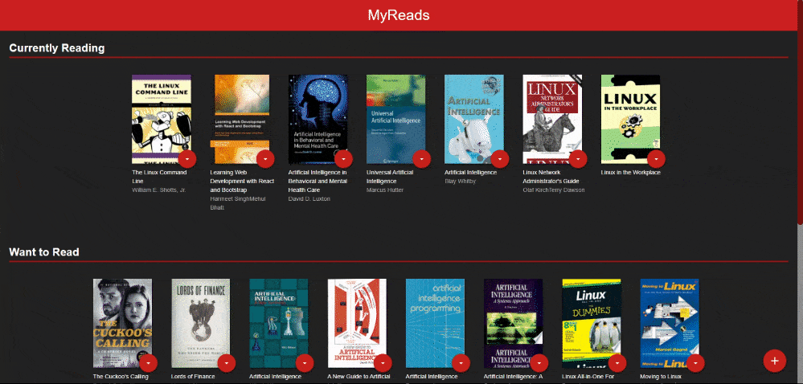

# MyReads: A Book Lending App

## App Preview

## Getting Started

The application was created with create-react-app and requires only `npm install` and `npm start` to get it installed and launched.

## App Content

- Main Page

  - The main page shows 3 shelves for books. Each book is shown on the correct shelf, along with its title and all of its authors.

  - The main page shows a control that allows users to move books between shelves. The control should be tied to each book instance. The functionality of moving a book to a different shelf works correctly.
  - When the browser is refreshed, the same information is displayed on the page.

- Search Page

  1. The search page has a search input field.

  2. The search page behaves correctly:
     a) As the user types into the search field, books that match the query are displayed on the page, along with their titles and authors. You can use throttle/debounce but are not required to do so.

     b) Search results are not shown when all of the text is deleted out of the search input box.

     c) Invalid queries are handled and prior search results are not shown.

     d) The search works correctly when a book does not have a thumbnail or an author. (To test this, try searching for "poetry" and "biography"). (It's fine to filter out books with missing thumbnails.)

     e) The user is able to search for multiple words, such as “artificial intelligence.”

  3. Search results on the search page allow the user to select “currently reading”, “want to read”, or “read” to place the book in a certain shelf.

  4. If a book is assigned to a shelf on the main page and that book appears on the search page, the correct shelf should be selected on the search page. If that book's shelf is changed on the search page, that change should be reflected on the main page as well. The option "None" should be selected if a book has not been assigned to a shelf.

  5. When an item is categorized on the search page and the user navigates to the main page, it appears on that shelf in the main page.

## Routing

- The main page contains a link to the search page. When the link is clicked, the search page is displayed and the URL in the browser’s address bar is /search.

- The search page contains a link to the main page. When the link is clicked, the main page is displayed and the URL in the browser’s address bar is /.
